<h1>:books: Literalura :books:</h1>

# Insignias

    
    
    
    
    

# Índice

- [Insignias](#insignias)

- [Descripción del proyecto](#descripción-del-proyecto)

- [Estado del proyecto](#estado-del-proyecto)

- [Demostración de funcionalidades](#demostración-de-funcionalidades)

    - [Funcionalidades del proyecto](#funcionalidades-del-proyecto)

    - [Uso del proyecto](#uso-del-proyecto)

- [Acceso al proyecto](#acceso-al-proyecto)

- [Teconologías utilizadas](#teconologías-utilizadas)

- [Persona Desarrolladora del Proyecto](#persona-desarrolladora-del-proyecto)

# Descripción del proyecto

¡Bienvenido/a a LiterAlura!
Es una aplicación en consola donde muestra información de los libros y autores que contiene la API Gutendex. En esta aplicación tiene diversas opciones como: buscar un libro por el título y se registra la información de dicho libro y la información de su autor en la base de datos, listar los libros registrados, listar los autores registrados, listar autores vivos en un determinado año y listar los libros por el idioma.

También, cuenta con tres opciones extras como lo son: mostrar las estadísticas de los libros por el número de descargas, mostrar los 10 libros con más descargas y buscar un autor por su nombre.

# Estado del proyecto

:white_check_mark: Proyecto completado

# Demostración de funcionalidades

## Funcionalidades del proyecto

- `Funcionalidad 1`: Tiene una conexión con la API de la página Gutendex para obtener la información de libros y autores de dichos libros.
- `Funcionalidad 2`: Contiene nueve opciones para realizar consultas de información de la API y a la base de datos, las cuales son:
    - Buscar un libro por título
    - Listar libros registrados
    - Listar autores registrados
    - Listar autores vivos en un determinado año
    - Listar libros por idioma
    - Estadísticas de libros por número de descargas
    - Top 10 libros más descargados
    - Buscar autor por nombre
    - Salir (Se cierra la aplicación)
- `Funcionalidad 3`: En la primera opción realiza una búsqueda introduciendo el título de un libro (ya sea todo completo o una parte). Muestra la información del primer libro encontrado y se guarda en la base de datos, incluyendo la información del autor de dicho libro buscado.
- `Funcionalidad 4`: En la segunda opción muestra informaciones (título, autor/es, primer idioma y número de descargas) de todos los libros registrados.
- `Funcionalidad 5`: En la tercera opción muestra informaciones (nombre, fecha de nacimiento y fecha de fallecido) de todos los autores junto con sus libros registrados.
- `Funcionalidad 6`: En la cuarta opción realiza una búsqueda de los autores que estaban vivos por un determinado año. Por ejemplo, si introduce el año 1600, muestra los autores vivos de ese año para atrás y los autores que fallecieron de ese año para adelante.
- `Funcionalidad 7`: En la quinta opción muestra información de uno o varios libros por idioma. Muestra una lista con los idiomas de libros disponibles, solo es introducir el idioma abreviado y muestra el libro o los libros del idioma buscado.
- `Funcionalidad 8`: En la sexta opción muestra estadísticas de todos los libros por el número de descargas. Muestra la cantidad media, máxima y mínima de número de descargas de todos los libros registrados en la base de datos.
- `Funcionalidad 9`: En la séptima opción muestra un top de 10 libros con más números de descargas. Los libros son tomados de la base de datos.
- `Funcionalidad 10`: En la octava opción realiza una búsqueda de un autor introduciendo su nombre (ya sea todo completo o una parte). Muestra la información del autor encontrado junto con los títulos de los libros de dicho autor.

## Uso del proyecto

Antes de iniciar la aplicacón, es importante primero hacer unas modificaciones al archivo application.properties. Esto es para que se conecte la aplicación a la base de datos.

Se deben modificar las siguientes variables por las variables que tu tengas:

`${DB_HOST}, ${DB_NAME}, ${DB_USER} y ${DB_PASSWORD}`

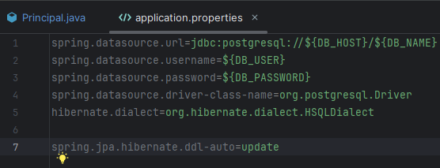

La aplicación inicia con un menú donde muestra las opciones que puede realizar el usuario. Para elegir una de las 8 opciones es necesario ingresar su número, en caso contrario, mostrará un mensaje indicando que ingrese un número del menú.

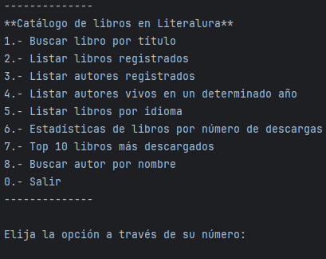

Al ingresar la opción 1 muestra un mensaje indicando "Escribe el título del libro que desea buscar, escribes el título y la aplicación primero busca si está registrado en la base de datos. Si no está, lo busca en la API Gutendex para obtener los datos de dicho libro. Cabe aclarar que sólo obtiene el primer libro encontrado en la API.

Al terminar la búsqueda, muestra un mensaje diciendo "Libro encontrado", luego muestra la información de dicho libro, después muestra otro mensaje diciendo que el libro se guardó, refiriéndose que se guardó en la base de datos junto con la información de su autor.

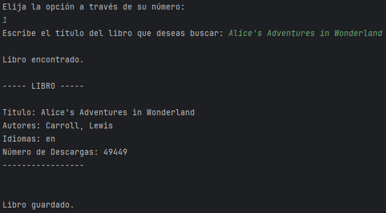

Al ingresar la opción 2 muestra un mensaje diciendo "Los libros registrados son los siguientes:" y después enlista todos los libros que están guardados en la base de datos.

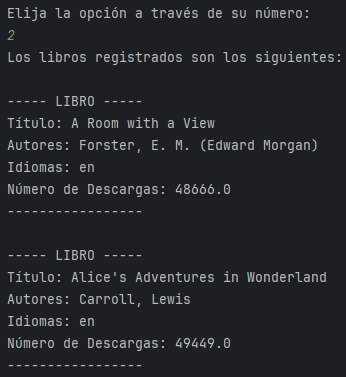

Al ingresar la opción 3 muestra un mensaje diciendo "Los autores registrados son los siguientes:" y después enlista todos los autores que están guardados en la base de datos. Los datos de dichos autores se guardan a la vez que se guarda la información de los libros.

También, en la información de los autores se muestra sólo los títulos de sus libros.

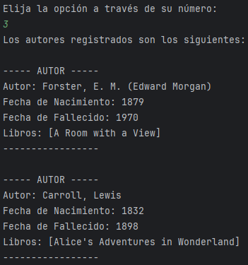

Al ingresar la opción 4 muestra un mensaje indicando "Escribe el año vivo del autor(es) que desea buscar:". Después de haber escrito el año muestra otro mensaje diciendo "El autor o los autores vivos del año (año ingresado) son los siguientes:" y al último enlista todos los autores que estaban vivos con sus respectivos datos. En este caso puede variar dependiendo del año escrito, si sólo aparece un autor o varios autores.

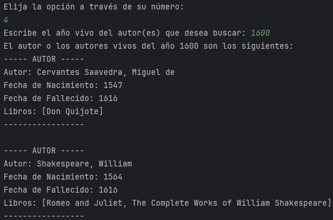

Al ingresar la opción 5 muestra un menú de los idiomas que están disponibles en la aplicación, luego muestra otro mensaje indicando "Escribe el el idioma abreviado para buscar los libros:". Después busca en la base de datos los libros con el idioma escrito y los muestra con sus respectivos datos. Como en la opción 4, también puede variar dependiendo del idioma escrito, si sólo aparece un libro o varios libros.

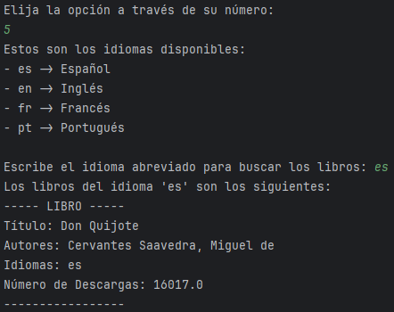

Al ingresar la opción 6 muestra un mensaje diciendo "Estadísticas de los libros por número de descargas:", y después muestra las cantidades media, máxima y mínima de descargas de los libros guardados en la base de datos.

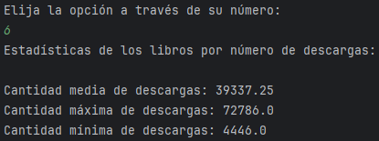

Al ingresar la opción 7 muestra un mensaje diciendo "Top 10 libros más descargados:", y después muestra los 10 libros que tienen más descargas de mayor a menor.

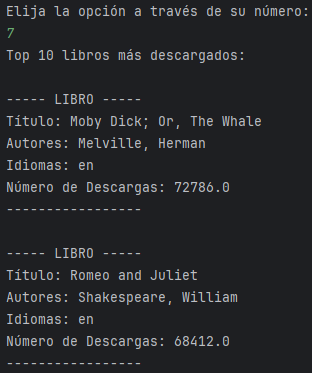

Y al ingresar la opción 8 muestra un mensaje diciendo "Escribe el nombre del autor que deseas buscar:", el nombre puede ser nombre completo o sólo una parte. Después realiza una búsqueda en la base de datos con el nombre ingresado y lo muestra con sus respectivos datos y los libros de dicho autor.

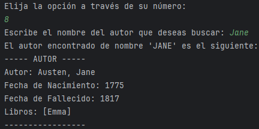

# Acceso al proyecto

Para poder usar el proyecto revisar las siguientes dos opciones.

Si no tienes instalado Git realiza lo siguiente:

- Das click en Code, luego click en Download ZIP y se descarga automáticamente el proyecto.

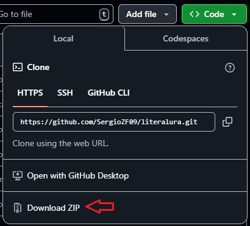

- Arrastra el .ZIP al IDE donde tienes los proyectos realizados (en Apache NetBeans, InelliJ IDEA, etc.).
- Seleccionas el proyecto y le das click en extract here o extraer aquí. Y al final eliminas el .ZIP.

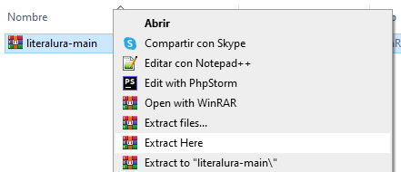

Si tienes instalado Git realiza lo siguiente:

- Das click en Code, luego click en donde están los dos cuadros y se copia en tu portapapeles la url.

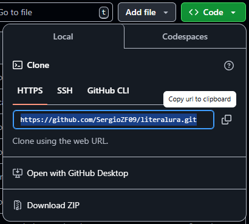

- Abres la terminal Git Bash, introduce `git clone` y la ruta (con las diagonales invertidas) donde se clonará el repositorio junto con el proyecto, pegas la url copiada, le das enter y se clona todo.

Para abrir el proyecto en IntelliJ IDEA realiza lo siguiente:

- Abrir IntelliJ IDEA y das click en Open o Abrir
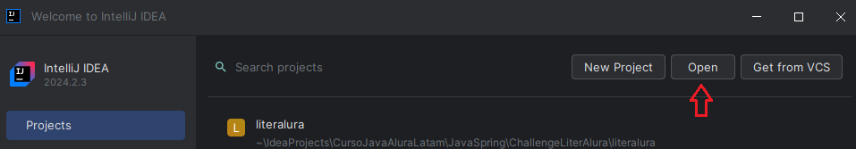

- Seleccionar el proyecto, das click en el botón azul OK y se abre.
- Y para arrancar el programa solo le das click en la flecha verde hasta arriba y listo.
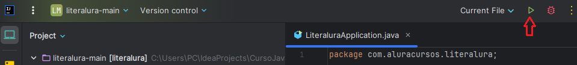

# Teconologías utilizadas

- Java 17
- Hibernate
- Spring Boot
- Maven
- PostgreSQL
- Gutendex API

# Persona Desarrolladora del Proyecto

[ Sergio Zuñiga Fraga](https://github.com/SergioZF09)

# Agradecimientos

Agradezco a la Instructora Genesys Rondon y al Instructor Eric Monné Fraga de Oliveira de Alura Latam junto con Apple por haber hecho un reto interesante y en donde pude aplicar todo lo aprendido en la formación de Java con Spring.
